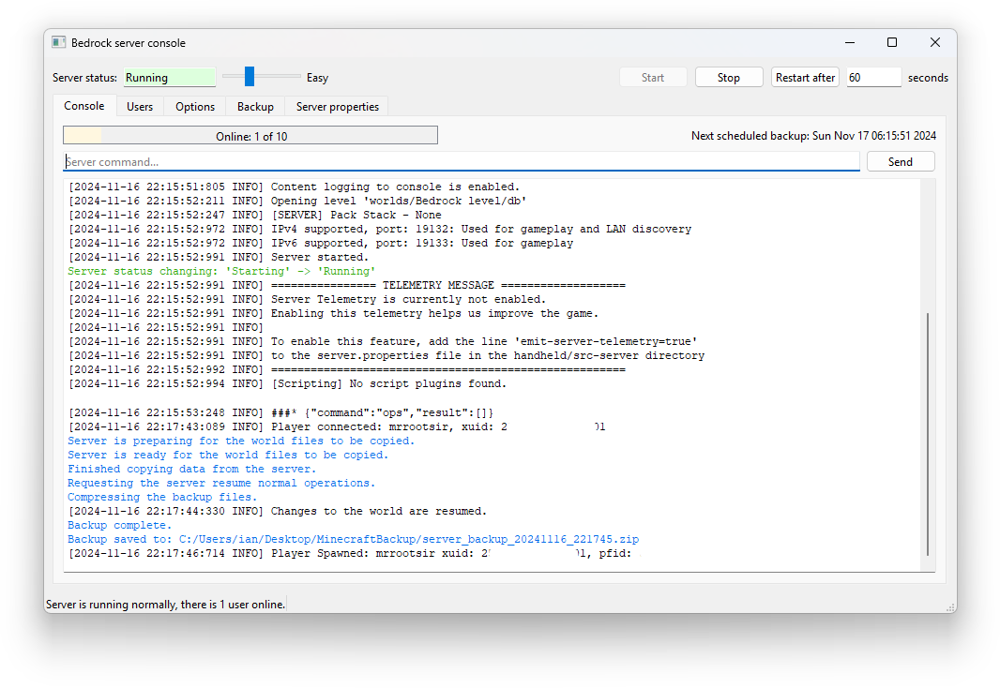
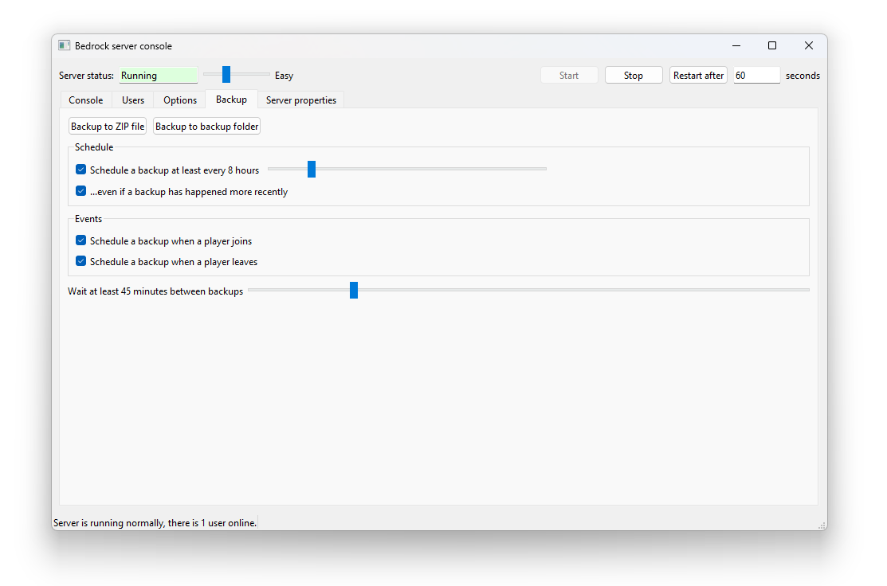

# Minecraft Bedrock Server Console

This provides a GUI console window for the experimental [Minecraft Bedrock edition server](https://www.minecraft.net/en-us/download/server/bedrock/) from Microsoft.

It started because I wanted a nice easy way of taking a backup from a running server.

To use it, install it and point it at your minecraft server.

Also, create a folder for backups, and tell it about that too.

**IMPORTANT:** There is no guarantee offered with this software. Make sure you have full backups before using it. There is no warranty AT ALL.

## Features

* Start/stop your server easly and safely.
* View the servers log output
* A console for sending commands to the server
* Take a backup without stopping the server
* Backups can be automatic, or on certain events.

## Users

This is a list of users on the server, you can change a users permission level. 

## Options

The options window lets you set where backups go, and where your server is.

You can also set limits on the amount of disk space used by backups, and other options relating to auto expiry.

## Backup triggers

Here you define what triggers a backup. 

The option to wait between backups is to prevent excessive load on a server should a lot of people join or leave in quick sucession. A triggered backup occuring within this number of minutes of the previous backup will be made to wait. Multiple backups triggered in the 'cooldown' period will only cause one to happen.

The `Backup to ZIP file` button will always trigger a backup.

## Backups

Backups are taken while the server is running. This is done in co-operation with the server and is perfectly safe. As well as your world files the backup contains some of the server settings files too.

### Restoring backups

**IMPORTANT**: The backup zip file contains a `worlds` folder, which contains the world that was running on the server when the backup was created. If you want to restore a backup it is not sufficient to copy this back over the folder on the server.

To restore a backup:

1. Shut down your server
2. In the server folder, delete or rename the `worlds` folder. If you have multiple worlds you should take a backup of this folder.
3. Copy the `worlds` folder from the backup zip to the server folder.
4. Start the server.

**You must not copy the `worlds` folder over an existing `worlds` folder as this does not seem to work correctly.**
